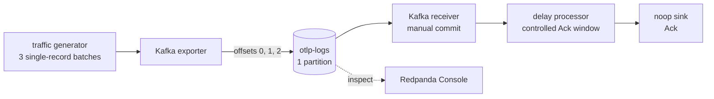

# Kafka at-least-once offsets: end-to-end validation

This example validates the OTAP Kafka receiver's manual-commit, at-least-once
behavior against a real Kafka broker:

1. In-order downstream acknowledgements advance the committed offset.
2. Killing the consumer after delivery but before acknowledgement leaves the
   offset uncommitted, so restart replays the messages.

The stack is fully containerized and includes Redpanda Console for inspecting
topic messages, consumer-group committed offsets, and lag.

## What runs



| Service | Role |
| --- | --- |
| `kafka` | Single-node plaintext KRaft broker |
| `kafka-init` | Creates `otlp-logs` with one deterministic partition |
| `producer` | Produces three Kafka messages at offsets 0, 1, and 2 |
| `consumer` | Manual-commit receiver followed by a configurable delay and noop sink |
| `console` | Web UI on <http://localhost:8082> |

The delay is before the terminal sink. A message is therefore already delivered
by Kafka while its downstream Ack is deliberately held back.

## Prerequisites

- Docker with Compose v2.
- PowerShell for the automated validation script.
- No local Rust toolchain is required.

Only run one Kafka example stack at a time because they share host ports 8080,
8082, and the same Compose service names.

## Automated validation

From this directory:

```powershell
.\scripts\Test-AtLeastOnceOffsets.ps1
```

The first run builds the shared `df_engine` image. Use `-SkipBuild` on later
runs when the image is already current:

```powershell
.\scripts\Test-AtLeastOnceOffsets.ps1 -SkipBuild
```

The script starts with a fresh ephemeral broker and asserts:

```text
PASS: producer created offsets 0, 1, and 2 in one partition.

Case 1: in-order acknowledgements advance the committed offset.
  committed=1, lag=2
  committed=2, lag=1
  committed=3, lag=0
PASS: committed offset advanced only after downstream Ack.

Case 2: a crash before Ack causes replay after restart.
  first process received all 3 messages; committed offset has not advanced.
  restarted process received the same 3 messages again.
PASS: restart replayed uncommitted messages, then committed offset 3.
```

The stack remains running after success so its final state can be inspected in
the Web UI.

## Web UI validation

Open <http://localhost:8082> and select **Consumer Groups**.

### Case 1: normal offset advancement

Open `offset-in-order`. Before the first commit, Console may show no committed
offset (`-`) or the safe starting position 0. During the test, the partition
advances through committed offsets 1, 2, and 3 while lag falls to 0. The delay
processor handles one message at a time, so each terminal noop-sink Ack exposes
the next safe offset.

### Case 2: replay after a crash

Open `offset-crash-replay`. Before the forced crash, the receiver's admin metric
reports all three messages delivered:

```powershell
curl.exe -s http://localhost:8080/api/v1/telemetry/metrics |
  Select-String records_received_total
```

The group has no committed progress beyond offset 0 because the 15-second delay
has not released an Ack. Depending on commit timing, Console may display `-` or
0 with lag 3. After the container is killed and restarted, the new process
reports three received messages again. Kafka replayed offsets 0, 1, and 2
because none had been acknowledged. Once the delayed Acks finish, Console shows
committed offset 3 and lag 0.

This is at-least-once delivery: a crash can cause duplicates, but the receiver
does not skip an unacknowledged message.

## Why out-of-order Ack is not simulated here

The public delay and noop nodes preserve delivery order; using timing races to
claim deterministic out-of-order behavior would make this example flaky.
Algorithm-level coverage lives in the Kafka receiver integration test
`out_of_order_acks_commit_only_lowest_contiguous`. It deliberately acknowledges
offsets 1 and 2 before offset 0 and verifies that the committed watermark stays
at the gap, then jumps to 3 only after offset 0 is acknowledged.

## Offset semantics

Kafka's committed offset is the **next** offset to read:

| Completed messages | Safe committed offset |
| --- | ---: |
| none | `0` |
| offset `0` | `1` |
| offsets `0` and `1` | `2` |
| offsets `0`, `1`, and `2` | `3` |

Tracking and commits are independent for every topic partition.

## Cleanup

```powershell
$env:COMPOSE_FILE = "compose.yaml;compose.dataflow.yaml"
docker compose down
Remove-Item Env:\KAFKA_GROUP_ID, Env:\ACK_DELAY -ErrorAction SilentlyContinue
```
