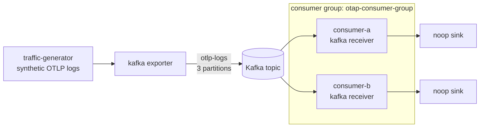

# Kafka consumer groups: end-to-end validation

This example validates the OTAP Kafka **receiver's consumer-group behavior**
with a fully containerized stack: coordinated consumption and partition
assignment across multiple receiver instances, the required consumer
`group_id`, and rebalance-aware offset handling.

Authentication and TLS are **out of scope** here and are validated separately;
this stack uses a single plaintext KRaft broker so the consumer-group behavior
is isolated from transport security.

## What runs



| Service      | Role                                                        |
| ------------ | ----------------------------------------------------------- |
| `kafka`      | Single-node plaintext KRaft broker (`cp-kafka:8.3.1`)       |
| `kafka-init` | Creates topic `otlp-logs` with **3 partitions**             |
| `producer`   | `df_engine`: traffic generator -> Kafka exporter            |
| `consumer-a` | `df_engine`: Kafka receiver (group `otap-consumer-group`)   |
| `consumer-b` | `df_engine`: Kafka receiver (same group, distinct client)   |

Both consumers run the **identical** `consumer.yaml`; only their
`KAFKA_CLIENT_ID` differs. Joining the same `group_id` is what makes the broker
distribute the topic's 3 partitions across them.

## Prerequisites

- Docker with Compose v2 (`docker compose version`).
- No local Rust toolchain needed; the engine image is built by Compose. The
  first build compiles `df_engine` and can take 10-30+ minutes. Subsequent runs
  are cached.

## Quick start

```bash
cd rust/otap-dataflow/examples/kafka/consumer-groups
docker compose -f compose.yaml -f compose.dataflow.yaml up --build
```

The producer sends a bounded batch (`KAFKA_MAX_SIGNAL_COUNT`, default 300) and
exits; the consumers keep running so you can inspect the group. `up` streams
logs in the foreground, so run the checks below from a **second** terminal.

The checks below use PowerShell (VS Code's default terminal). Set the compose
file list once so every command can omit the `-f` flags (otherwise Compose
fails with `no such service: consumer-a`):

```powershell
$env:COMPOSE_FILE = "compose.yaml;compose.dataflow.yaml"
```

## Web UI (Redpanda Console)

The stack includes a [Redpanda Console](https://github.com/redpanda-data/console)
container for browsing topics, messages, and consumer groups (with per-partition
lag) from a browser. It starts automatically with the broker; open
<http://localhost:8082>.

Under **Consumer Groups**, watch `otap-consumer-group` split its 3 partitions
across `consumer-a`/`consumer-b` and drain to zero lag - the same evidence as the
CLI checks below. Under **Topics** you can inspect `otlp-logs` and its messages.

## Validation

Run these from a second terminal (not the one running `up`, whose streaming
output mangles typed input).

### 1. Partition assignment is split across instances

Each receiver logs the partitions it is assigned during every rebalance.

```powershell
docker compose logs consumer-a | Select-String kafka.rebalance.partitions_assigned
docker compose logs consumer-b | Select-String kafka.rebalance.partitions_assigned
```

Expected: each consumer is assigned a **disjoint** subset of partitions
`{0,1,2}`, and the **union across both consumers covers all 3 partitions**. For
example one instance owns `{0,2}` and the other owns `{1}`. The exact split
depends on join timing; what matters is that the partitions are partitioned
(no overlap) and fully covered.

### 2. Coordinated consumption drains group lag to zero

Ask the broker to describe the group directly:

```powershell
docker compose exec kafka kafka-consumer-groups --bootstrap-server kafka:9092 --describe --group otap-consumer-group
```

Expected:

- Two rows with distinct `CONSUMER-ID` / `CLIENT-ID` (`consumer-a`,
  `consumer-b`), each owning a subset of the partitions.
- Once the producer's bounded run is fully consumed, `LAG` is `0` for every
  partition. That confirms the members collectively consumed the whole topic
  and committed their offsets.

Lag is also exported per receiver as the `group_lag` gauge (OTel scope
`receiver.kafka.consumer`, refreshed every 5s) on each consumer's admin
endpoint:

```powershell
curl.exe -s localhost:8080/api/v1/telemetry/metrics | Select-String group_lag   # consumer-a
curl.exe -s localhost:8081/api/v1/telemetry/metrics | Select-String group_lag   # consumer-b
```

### 3. `group_id` is required

The receiver rejects an empty `group_id` at config validation. `consumer.yaml`
sets it via `KAFKA_GROUP_ID` (default `otap-consumer-group`). To see the guard,
run one engine with an empty value:

```powershell
docker compose run --rm --no-deps -e KAFKA_GROUP_ID= consumer-a --config file:/home/nonroot/consumer.yaml --validate-and-exit
```

Expected: validation fails because the consumer group id must be non-empty.

### 4. Rebalance-aware offset handling

Trigger a membership change and watch the surviving instance take over the
revoked partitions with no gap and no re-consumption.

```powershell
# Stop one member; consumer-a should be assigned the freed partitions.
docker compose stop consumer-b
docker compose logs --since 30s consumer-a | Select-String kafka.rebalance.partitions_assigned

# Re-describe: consumer-a now owns all 3 partitions and lag returns to 0.
docker compose exec kafka kafka-consumer-groups --bootstrap-server kafka:9092 --describe --group otap-consumer-group

# Bring the second member back; partitions re-split across both.
docker compose start consumer-b
```

Because the receiver commits owned partitions **before** they are revoked
(commit-before-revoke) and uses manual commit (offsets committed only after the
downstream sink accepts the batch), a rebalance does not drop or double-count
in-flight data. `consumer-b`'s graceful stop commits its progress before
leaving, so `consumer-a` resumes exactly where it left off. The
`cooperative_sticky` strategy means only the partitions that actually move are
revoked and reassigned, not the entire assignment.

### 5. One instance, multiple cores (each core is a group member)

The engine is thread-per-core: `--num-cores N` runs the whole pipeline on N
pinned threads, and the Kafka receiver is instantiated per core. So a single
container joins the group as **N distinct members** - same `client_id`, but each
with its own broker-assigned `member.id`. Recreate `consumer-a` with 2 cores:

```powershell
$env:CONSUMER_A_CORES = "2"
docker compose up -d --no-deps consumer-a
```

Its two cores each log a partition assignment - note `core.id=0` vs `core.id=1`
in the same container's output:

```powershell
docker compose logs consumer-a | Select-String kafka.rebalance.partitions_assigned
```

```
partitions=otlp-logs:1 ... core.id=0
partitions=otlp-logs:0 ... core.id=1
```

`--describe` now shows three members - two of them are the single `consumer-a`
container (same HOST and CLIENT-ID, different CONSUMER-ID) plus `consumer-b`:

```powershell
docker compose exec kafka kafka-consumer-groups --bootstrap-server kafka:9092 --describe --group otap-consumer-group
```

```
PARTITION  LAG  CONSUMER-ID              HOST         CLIENT-ID
1          0    consumer-a-00a790ef-...  /172.19.0.4  consumer-a   # core 0
0          0    consumer-a-78cb37e2-...  /172.19.0.4  consumer-a   # core 1
2          0    consumer-b-b04ddc6a-...  /172.19.0.6  consumer-b
```

Stop `consumer-b` and `consumer-a`'s two cores cover all three partitions by
themselves (for example core 0 owns `{1,2}` and core 1 owns `{0}`). Parallelism
is still capped by the partition count (3): members across every container and
its cores beyond 3 sit idle.

Return to the single-core default when done:

```powershell
Remove-Item Env:\CONSUMER_A_CORES
docker compose up -d --no-deps consumer-a
```

### 6. Multiple cores raise throughput (thread-per-core decode)

Cases 1-5 prove *coordination*; this one measures *throughput*. The sink is
`noop`, so the only per-record CPU cost is OTLP-proto decode. librdkafka already
fetches every assigned partition in parallel background threads on a single core,
so extra engine cores help **only when decode is the bottleneck** - that is, with
a large, decode-heavy backlog. A trivially small load is fetch/IO-bound and looks
identical at any core count.

This case is gated behind the `bench` Compose profile, so a plain `up` never
starts it and cases 1-5 stay pristine. It adds two services:

| Service (bench profile) | Role                                                            |
| ----------------------- | -------------------------------------------------------------- |
| `producer-bench`        | Writes a large backlog of heavy records (`producer-bench.yaml`) |
| `consumer-c`            | Kafka receiver in its **own** group, so it owns all 3 partitions alone (admin on port 8083) |

`consumer-c` uses its own group on purpose: with all 3 partitions to itself, the
1-core vs 3-core comparison is clean and independent of `consumer-a`/`consumer-b`.

**Stage a fixed backlog.** Reset to an empty topic, then produce 4,000,000 log
records (~5.8 GB) as heavy 200-record batches:

```powershell
$env:COMPOSE_FILE = "compose.yaml;compose.dataflow.yaml"
docker compose down; docker compose up -d kafka kafka-init console
$env:KAFKA_MAX_SIGNAL_COUNT = "4000000"
docker compose --profile bench up -d --no-deps producer-bench
```

`producer-bench` exits once it has produced `KAFKA_MAX_SIGNAL_COUNT` records.
Confirm the backlog - the sum of end offsets is the number of Kafka messages, and
each message is a 200-record batch:

```powershell
docker compose exec kafka kafka-get-offsets --bootstrap-server kafka:9092 --topic otlp-logs
# otlp-logs:0:6856  otlp-logs:1:6321  otlp-logs:2:6823  ->  20000 messages = 4,000,000 records
```

**Drain with 1 core.** A fresh group re-reads from earliest, so each run starts
from the full backlog. Re-run `--describe` until `LAG` is 0, timing how long it
takes (or watch the group in the Console UI):

```powershell
$env:CONSUMER_C_CORES = "1"; $env:CONSUMER_C_GROUP = "bench-1core"
docker compose up -d --no-deps consumer-c
docker compose exec kafka kafka-consumer-groups --bootstrap-server kafka:9092 --describe --group bench-1core
```

**Drain with 3 cores** from the same backlog, using a new group:

```powershell
docker compose rm -sf consumer-c
$env:CONSUMER_C_CORES = "3"; $env:CONSUMER_C_GROUP = "bench-3core"
docker compose up -d --no-deps consumer-c
docker compose exec kafka kafka-consumer-groups --bootstrap-server kafka:9092 --describe --group bench-3core
```

Measured wall-clock time to drain the 20,000-message (4,000,000-record) backlog
to zero lag on a laptop:

| Cores | Group members                                | Drain time |
| ----: | -------------------------------------------- | ---------- |
|     1 | 1 (owns all 3 partitions, decodes serially)  | ~20 s      |
|     3 | 3 (one partition each, decode in parallel)   | ~11 s      |

Adding cores nearly halved the drain time. The receiver's throughput counter is
**per core** - one series per `core.id` - so sum the series for a container's
total:

```powershell
curl.exe -s http://localhost:8083/api/v1/telemetry/metrics | Select-String records_received_total
# core_id=0 -> 6856   core_id=1 -> 6321   core_id=2 -> 6823   (sum 20000)
```

Each core owned exactly one partition and processed it end to end.
(`records_received_total` counts Kafka *messages* - the 200-record batches - not
individual log records.)

The speedup is real but sub-linear (not 3x): a single broker with
replication-factor 1 leaves fetch partly IO-bound, and a fixed startup/rebalance
cost (~4-6 s) is included in both runs. As in case 5, parallelism is capped by
the partition count (3) - a 4th core would sit idle.

Return to the default stack when done:

```powershell
docker compose rm -sf consumer-c producer-bench
Remove-Item Env:\CONSUMER_C_CORES, Env:\CONSUMER_C_GROUP, Env:\KAFKA_MAX_SIGNAL_COUNT -ErrorAction SilentlyContinue
```

## Configuration knobs

| Variable                   | Default               | Effect                                         |
| -------------------------- | --------------------- | ---------------------------------------------- |
| `KAFKA_MAX_SIGNAL_COUNT`   | `300`                 | Total log records to produce; `null` for a continuous stream |
| `KAFKA_SIGNALS_PER_SECOND` | `50`                  | Producer emit rate                             |
| `KAFKA_GROUP_ID`           | `otap-consumer-group` | Consumer group all instances join              |
| `KAFKA_CLIENT_ID`          | per service           | Distinguishes instances in the group           |
| `KAFKA_TOPIC`              | `otlp-logs`           | Topic produced to / consumed from              |
| `KAFKA_BROKERS`            | `kafka:9092`          | Broker bootstrap address                       |
| `CONSUMER_A_CORES`         | `1`                   | Cores for `consumer-a`; each core joins the group as its own member (set `2`+ for case 5) |
| `CONSUMER_C_CORES`         | `3`                   | Cores for `consumer-c` in the throughput benchmark (case 6); set `1` vs `3` to compare |
| `CONSUMER_C_GROUP`         | `otap-consumer-c-group` | `consumer-c`'s group; use a fresh value per benchmark run to re-read from earliest |

The `bench` profile also has these `producer-bench` knobs (case 6 only; the
default `producer` is unaffected). Its own `KAFKA_MAX_SIGNAL_COUNT` default is
`250000`:

| Variable               | Default | Effect                                                       |
| ---------------------- | ------- | ------------------------------------------------------------ |
| `KAFKA_NUM_LOG_ATTRS`  | `25`    | Attributes per log record; more attributes = heavier decode  |
| `KAFKA_LOG_BODY_BYTES` | `64`    | Log body size in bytes                                       |
| `KAFKA_MAX_BATCH_SIZE` | `200`   | Records per Kafka message; keep batches under the broker's ~1 MB limit |

## Cleanup

```powershell
docker compose down -v
```
