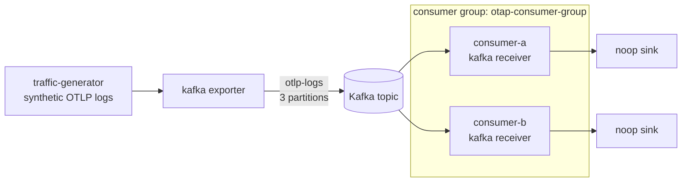

# Kafka consumer groups: end-to-end validation

This example validates the OTAP Kafka **receiver's consumer-group behavior**
with a fully containerized stack: coordinated consumption and partition
assignment across multiple receiver instances, the required consumer
`group_id`, and rebalance-aware offset handling.

Authentication and TLS are **out of scope** here and are validated separately;
this stack uses a single plaintext KRaft broker so the consumer-group behavior
is isolated from transport security.

## What runs



| Service      | Role                                                        |
| ------------ | ----------------------------------------------------------- |
| `kafka`      | Single-node plaintext KRaft broker (`cp-kafka:8.3.1`)       |
| `kafka-init` | Creates topic `otlp-logs` with **3 partitions**             |
| `producer`   | `df_engine`: traffic generator -> Kafka exporter            |
| `consumer-a` | `df_engine`: Kafka receiver (group `otap-consumer-group`)   |
| `consumer-b` | `df_engine`: Kafka receiver (same group, distinct client)   |

Both consumers run the **identical** `consumer.yaml`; only their
`KAFKA_CLIENT_ID` differs. Joining the same `group_id` is what makes the broker
distribute the topic's 3 partitions across them.

## Prerequisites

- Docker with Compose v2 (`docker compose version`).
- No local Rust toolchain needed; the engine image is built by Compose. The
  first build compiles `df_engine` and can take 10-30+ minutes. Subsequent runs
  are cached.

## Quick start

```bash
cd rust/otap-dataflow/examples/kafka/consumer-groups
docker compose -f compose.yaml -f compose.dataflow.yaml up --build
```

The producer sends a bounded batch (`KAFKA_MAX_SIGNAL_COUNT`, default 300) and
exits; the consumers keep running so you can inspect the group. Use a second
terminal for the checks below.

## Validation

### 1. Partition assignment is split across instances

Each receiver logs the partitions it is assigned during every rebalance.

```bash
docker compose logs consumer-a | grep kafka.rebalance.partitions_assigned
docker compose logs consumer-b | grep kafka.rebalance.partitions_assigned
```

Expected: each consumer is assigned a **disjoint** subset of partitions
`{0,1,2}`, and the **union across both consumers covers all 3 partitions**. For
example one instance owns `{0,2}` and the other owns `{1}`. The exact split
depends on join timing; what matters is that the partitions are partitioned
(no overlap) and fully covered.

### 2. Coordinated consumption drains group lag to zero

Ask the broker to describe the group directly:

```bash
docker compose exec kafka \
  kafka-consumer-groups --bootstrap-server kafka:9092 \
  --describe --group otap-consumer-group
```

Expected:

- Two rows with distinct `CONSUMER-ID` / `CLIENT-ID` (`consumer-a`,
  `consumer-b`), each owning a subset of the partitions.
- Once the producer's bounded run is fully consumed, `LAG` is `0` for every
  partition. That confirms the members collectively consumed the whole topic
  and committed their offsets.

Lag is also exported per receiver as `receiver.kafka.consumer.group.lag`
(refreshed every 5s) on each consumer's admin endpoint:

```bash
curl -s localhost:8080/telemetry/metrics | grep -i group   # consumer-a
curl -s localhost:8081/telemetry/metrics | grep -i group   # consumer-b
```

### 3. `group_id` is required

The receiver rejects an empty `group_id` at config validation. `consumer.yaml`
sets it via `KAFKA_GROUP_ID` (default `otap-consumer-group`). To see the guard,
run one engine with an empty value:

```bash
docker compose run --rm --no-deps -e KAFKA_GROUP_ID= consumer-a \
  --config file:/home/nonroot/consumer.yaml --validate-and-exit
```

Expected: validation fails because the consumer group id must be non-empty.

### 4. Rebalance-aware offset handling

Trigger a membership change and watch the surviving instance take over the
revoked partitions with no gap and no re-consumption.

```bash
# Stop one member; consumer-a should be assigned the freed partitions.
docker compose stop consumer-b
docker compose logs --since 30s consumer-a | grep kafka.rebalance.partitions_assigned

# Re-describe: consumer-a now owns all 3 partitions and lag returns to 0.
docker compose exec kafka \
  kafka-consumer-groups --bootstrap-server kafka:9092 \
  --describe --group otap-consumer-group

# Bring the second member back; partitions re-split across both.
docker compose start consumer-b
```

Because the receiver commits owned partitions **before** they are revoked
(commit-before-revoke) and uses manual commit (offsets committed only after the
downstream sink accepts the batch), a rebalance does not drop or double-count
in-flight data. `consumer-b`'s graceful stop commits its progress before
leaving, so `consumer-a` resumes exactly where it left off. The
`cooperative_sticky` strategy means only the partitions that actually move are
revoked and reassigned, not the entire assignment.

## Configuration knobs

| Variable                   | Default               | Effect                                         |
| -------------------------- | --------------------- | ---------------------------------------------- |
| `KAFKA_MAX_SIGNAL_COUNT`   | `300`                 | Producer batch size; `null` for a continuous stream |
| `KAFKA_SIGNALS_PER_SECOND` | `50`                  | Producer emit rate                             |
| `KAFKA_GROUP_ID`           | `otap-consumer-group` | Consumer group all instances join              |
| `KAFKA_CLIENT_ID`          | per service           | Distinguishes instances in the group           |
| `KAFKA_TOPIC`              | `otlp-logs`           | Topic produced to / consumed from              |
| `KAFKA_BROKERS`            | `kafka:9092`          | Broker bootstrap address                       |

## Cleanup

```bash
docker compose -f compose.yaml -f compose.dataflow.yaml down -v
```
