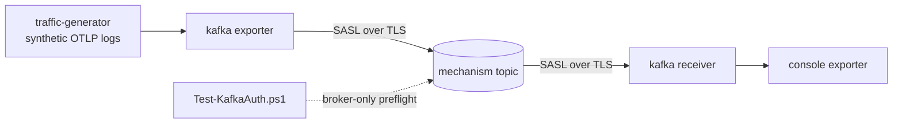

# Kafka SASL over TLS: end-to-end validation

This example validates the OTAP Kafka **exporter and receiver over an
authenticated, encrypted connection**: SASL authentication (PLAIN,
SCRAM-SHA-256, SCRAM-SHA-512) layered on TLS transport encryption. It runs a
fully containerized stack, so no local Rust toolchain, OpenSSL, or `libclang`
is required.

Consumer-group coordination is **out of scope** here and is validated
separately. Each mechanism runs an independent producer/consumer pair against
its own topic so the three authentication paths are verified in isolation.

| Mechanism       | Topic                | Consumer group          |
| --------------- | -------------------- | ----------------------- |
| `PLAIN`         | `otlp-logs-plain`    | `otap-plain-consumer`   |
| `SCRAM-SHA-256` | `otlp-logs-scram-256`| `otap-scram-256-consumer` |
| `SCRAM-SHA-512` | `otlp-logs-scram-512`| `otap-scram-512-consumer` |

The credentials and generated certificates are for local development only.

## What runs

The stack runs this path independently for each mechanism:



| Service      | Role                                                                     |
| ------------ | ------------------------------------------------------------------------ |
| `certgen`    | Generates the local CA + broker cert (SAN covers `kafka`), JKS stores, JAAS |
| `kafka`      | Single-node KRaft broker; `SASL_SSL` listener advertised as `kafka:9093` |
| `kafka-init` | Creates the SCRAM users and the three per-mechanism topics               |
| `dataflow`   | `df_engine`: runs all six pipelines (a producer + consumer per mechanism)|

All six pipelines run in the **single** `dataflow` container. Each producer is a
traffic generator feeding a Kafka exporter; each consumer is a Kafka receiver
feeding a console exporter. Every node authenticates with SASL over TLS and
trusts the CA that `certgen` wrote into `./certs` (mounted read-only at
`/home/nonroot/certs`).

## Prerequisites

- Docker with Compose v2 (`docker compose version`).
- No local Rust toolchain needed; the engine image is built by Compose. The
  first build compiles `df_engine` and can take 10-30+ minutes. Subsequent runs
  are cached.

## Quick start

```bash
cd rust/otap-dataflow/examples/kafka/sasl-tls
docker compose -f compose.yaml -f compose.dataflow.yaml up --build
```

`certgen` mints the certificates, `kafka-init` creates the SCRAM users and
topics, then the `dataflow` engine connects to `kafka:9093` over SASL/TLS. Each
producer emits a bounded batch (20 signals, `pre_generated`) and stops; the
receivers keep running so you can inspect the groups. `up` streams logs in the
foreground, so run the checks below from a **second** terminal.

The checks below use PowerShell (VS Code's default terminal). Set the compose
file list once so every command can omit the `-f` flags (otherwise Compose
fails with `no such service: dataflow`):

```powershell
$env:COMPOSE_FILE = "compose.yaml;compose.dataflow.yaml"
```

## Web UI (Redpanda Console)

The stack includes a [Redpanda Console](https://github.com/redpanda-data/console)
container that connects to the broker **over SASL/TLS** (the static PLAIN user
`plain`, trusting the local CA) - so the UI itself exercises the authenticated
path. It starts automatically with the broker; open <http://localhost:8082>.

Under **Topics** you can inspect `otlp-logs-plain`, `otlp-logs-scram-256`, and
`otlp-logs-scram-512` and their messages; under **Consumer Groups** each
mechanism's group shows zero lag once the engine drains it. That the console can
list the cluster at all is itself proof the SASL/TLS handshake succeeds.

## Validation

### 1. The broker accepts each mechanism over TLS (optional preflight)

This is a broker-only check using Kafka's own client tools; it does not involve
`df_engine`. On Windows PowerShell:

```powershell
./scripts/Test-KafkaAuth.ps1
```

Expected:

```text
PASS: PLAIN over TLS - kafka:9093 ...
PASS: SCRAM-SHA-256 over TLS - kafka:9093 ...
PASS: SCRAM-SHA-512 over TLS - kafka:9093 ...
```

### 2. The engine produced and consumed over SASL/TLS

The `dataflow` container's log is the end-to-end proof: every receiver had to
complete a SASL/TLS handshake to be assigned its partition, and the console
exporter only prints records the receiver decoded.

```powershell
# Each consumer pipeline acquired its topic partition after authenticating.
docker compose logs dataflow | Select-String partitions_assigned

# The console exporters emitted decoded OTLP logs (resource/scope present).
docker compose logs dataflow | Select-String "resource|scope" | Select-Object -First 20
```

Expected: a partition-assignment line for each of `plain-consumer`,
`scram-256-consumer`, and `scram-512-consumer`, and decoded log output. Console
output from the concurrent pipelines is interleaved, so use the per-group check
below to confirm each mechanism drained its topic.

### 3. Each consumer group reached zero lag

Ask the broker to describe each group directly. Zero lag proves the receiver
authenticated, consumed every produced message, and committed its offsets.

```powershell
foreach ($g in "otap-plain-consumer", "otap-scram-256-consumer", "otap-scram-512-consumer") {
  docker compose exec kafka kafka-consumer-groups --bootstrap-server kafka:29092 --describe --group $g
}
```

Expected for every group: `CURRENT-OFFSET` equals `LOG-END-OFFSET` and `LAG` is
`0` for the partition. If the engine is stopped before you check, the broker may
report the group has no active members; committed offsets and zero lag remain
valid delivery evidence.

## Configuration knobs

| Variable         | Default                      | Effect                                   |
| ---------------- | ---------------------------- | ---------------------------------------- |
| `KAFKA_BROKERS`  | `kafka:9093`                 | Broker bootstrap address (SASL/TLS listener) |
| `KAFKA_CA_FILE`  | `/home/nonroot/certs/ca.crt` | CA the engine trusts for the broker cert |

Both are set on the `dataflow` service in `compose.dataflow.yaml` and consumed
by `kafka-sasl-tls.yaml` via `${env:...}` substitution.

## Troubleshooting

Inspect container logs:

```powershell
docker compose logs --no-log-prefix certgen
docker compose logs --no-log-prefix kafka
docker compose logs --no-log-prefix dataflow
```

Regenerate certificates and broker state from scratch:

```powershell
docker compose down -v
Remove-Item -Recurse -Force certs
docker compose up --build
```

## Cleanup

```powershell
docker compose down -v
Remove-Item -Recurse -Force certs
```
