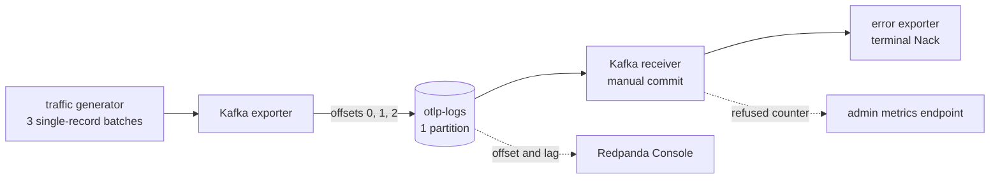

# Kafka terminal failure: drop-and-count validation

This example validates the Kafka receiver's existing behavior when downstream
processing ends in a terminal negative acknowledgement (Nack):

1. The failed record is not retried or redelivered.
2. Its Kafka offset is committed and advanced.
3. The terminal failure is counted and surfaced in receiver telemetry.
4. The pipeline drains instead of stalling on the failed record.

The stack is fully containerized and includes Redpanda Console for inspecting
the consumer group's committed offset and lag.

## What runs



| Service | Role |
| --- | --- |
| `kafka` | Single-node plaintext KRaft broker |
| `kafka-init` | Creates `otlp-logs` with one deterministic partition |
| `producer` | Produces three Kafka messages at offsets 0, 1, and 2 |
| `consumer` | Kafka receiver followed by an error exporter that Nacks every message |
| `console` | Web UI on <http://localhost:8082> |

The error exporter is a deterministic test sink. Every admitted logs message
receives a terminal Nack, so the validation does not depend on network failures
or timing races.

## Prerequisites

- Docker with Compose v2.
- PowerShell for the automated validation script.
- No local Rust toolchain is required.

Only run one Kafka example stack at a time because they share host ports 8080,
8082, and the same Compose service names.

## Automated validation

From this directory:

```powershell
.\scripts\Test-TerminalFailure.ps1
```

The first run builds the shared `df_engine` image. Use `-SkipBuild` on later
runs when the image is already current:

```powershell
.\scripts\Test-TerminalFailure.ps1 -SkipBuild
```

The script starts with a fresh ephemeral broker and asserts:

```text
PASS: producer created offsets 0, 1, and 2 in one partition.
PASS: all 3 failed records were counted as terminal refused responses.
PASS: terminal Nacks advanced the committed offset to 3 and drained lag.
PASS: the pipeline stayed live without retrying the failed records.

All terminal failure drop-and-count validations passed.
```

The stack remains running after success so the final state and metrics can be
inspected.

## Inspect the result

### Dropped-record counter

Query the consumer's admin endpoint:

```powershell
curl.exe -s http://localhost:8080/api/v1/telemetry/metrics |
  Select-String 'responses_total|records_received_total|records_inflight'
```

The significant series are:

```text
responses_total{otel_scope_name="receiver.kafka.acknowledgements",outcome="refused",signal="logs",...} 3
records_received_total{otel_scope_name="receiver.kafka.consumer",...} 3
records_inflight{otel_scope_name="receiver.kafka.consumer",...} 0
```

`responses_total{outcome="refused"}` is the receiver's surfaced count of
terminal Nacks. Its value of 3 matches the three records delivered by Kafka.
`records_inflight` returning to 0 proves no failed record remains stuck in the
pipeline.

### Offset advancement and no stall

Open <http://localhost:8082>, select **Consumer Groups**, open
`terminal-failure-drop-count`, and select `otlp-logs`. The single partition
shows:

| Group offset | Log-end offset | Lag |
| ---: | ---: | ---: |
| 3 | 3 | 0 |

Kafka's group offset is the next offset to read. Offset 3 and lag 0 mean the
receiver advanced past failed records 0, 1, and 2 and the group drained.

The script waits another three seconds and verifies that both
`records_received_total` and the refused-response counter remain at 3. This
proves there was no retry or redelivery loop.

## Observed behavior and gaps

The Kafka receiver currently treats every Nack reaching it as terminal,
regardless of whether the Nack is transient or permanent. It records the
response with `outcome="refused"` and advances the offset through the same
manual-commit path used by an Ack.

The implementation and metric contract are documented in:

- [Kafka receiver failure handling](../../../crates/contrib-nodes/src/receivers/kafka_receiver/README.md#failure-handling-and-retries)
- [`receiver.kafka.acknowledgements.responses`](../../../crates/contrib-nodes/src/receivers/kafka_receiver/README.md#receiverkafkaacknowledgements)

Current gaps:

- There is no dedicated `records_dropped_total` metric. The refused
  acknowledgement counter is the available terminal-drop signal.
- The Kafka receiver itself does not retry a terminally Nacked record.
- The Kafka receiver does not route the failed record to a dead-letter queue.
- A retry processor must handle transient failures before a terminal Nack
  reaches the receiver.

## Cleanup

```powershell
$env:COMPOSE_FILE = "compose.yaml;compose.dataflow.yaml"
docker compose down
```
